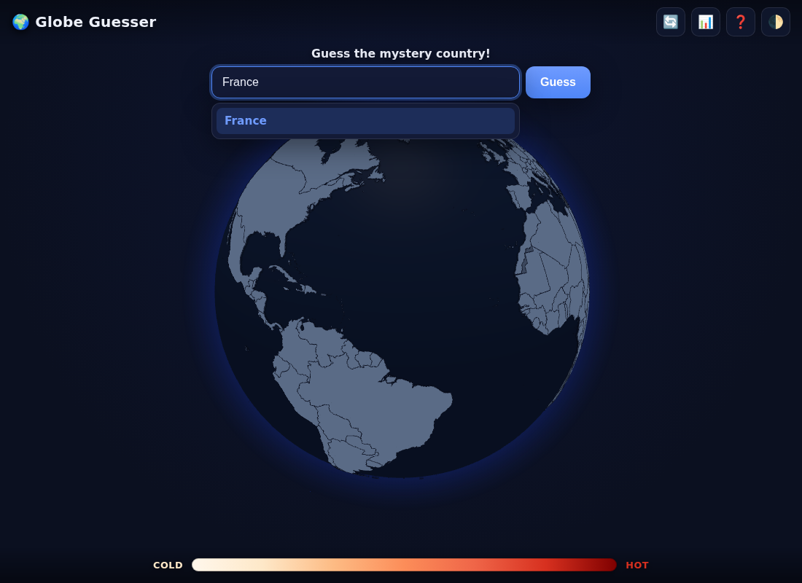

# 🌍 Globe Guesser

An **unlimited**, Globle‑style geography game on an interactive 3D globe. A secret
country is chosen at random; type any country and the globe spins to it and colours
it by how close it is to the target — pale when far, deep red when close. A bar at
the bottom tracks your nearest guess. Find the country in as few guesses as you can,
then play again. Forever.



## Features

- 🌐 **Interactive 3D globe** (drag to spin) rendered with [globe.gl](https://globe.gl) / three.js.
- ♾️ **Unlimited play** — a new random country every game, not a once‑a‑day puzzle.
- 🎯 **Proximity colouring** — every guess is shaded on a warm heat ramp by its
  great‑circle distance to the target.
- ✈️ **Auto fly‑to** — the globe smoothly rotates to centre on each country you guess.
- 🌡️ **Closest‑guess bar** along the bottom, with a marker for your best guess so far.
- 🏷️ **Hover any country** for its name (and its proximity once guessed).
- 🔤 **Forgiving input** with keyboard‑navigable autocomplete and lots of aliases
  (`USA`, `UK`, `DRC`, `Côte d'Ivoire`, `Czech Republic`, …).
- 📊 **Local stats** (played, win %, average guesses, best, streak) and 🌓 light/dark themes.
- 🔒 **Honest backend** — the target country is kept on the server and never sent to
  the browser until the game ends.
- ✅ **Tested** — 33 unit/integration tests covering distance maths, country resolution,
  game logic and the HTTP API.

## Quick start

Requires **Node.js 18+**.

```bash
npm install      # install the server dependency (express)
npm start        # serve at http://localhost:3000
```

Then open <http://localhost:3000>. Set a custom port with `PORT=8080 npm start`.

```bash
npm test               # run the test suite
npm run dev            # start with --watch for development
node scripts/build-data.js   # rebuild data/countries.geojson from Natural Earth

# Refresh the vendored globe.gl bundle (only needed to bump its version):
npm install --no-save globe.gl && npm run build:vendor
```

## How it works

```
Browser (public/)                         Server (server.js + lib/)
─────────────────                         ─────────────────────────
GlobeView (globe.gl)  ── POST /api/games ──▶  pick a hidden random country
Autocomplete                                  (kept in memory, never leaked)
                       ◀── { gameId } ──────
                       ── POST .../guesses ─▶  resolve name → country,
proximity colouring ◀── { proximity, … } ──   haversine distance → proximity
proximity bar / list                          (target revealed only on win/giveup)
```

The browser renders the globe and handles input; the server owns the secret answer
and scores each guess. Proximity is `1 − distance / halfEarthCircumference`, where
distance is the great‑circle (haversine) distance between the two countries' anchor
points. The same value drives the polygon colour, the guess list and the bottom bar.

### HTTP API

| Method & path | Purpose |
| --- | --- |
| `GET /api/health` | Service health and country counts |
| `GET /api/countries` | Guessable country names (for autocomplete) |
| `POST /api/games` | Start a game → `{ gameId }` |
| `GET /api/games/:id` | Public game state (no hidden target) |
| `POST /api/games/:id/guesses` | Submit `{ guess }` → scored result |
| `POST /api/games/:id/giveup` | Reveal the answer and end the game |
| `GET /countries.geojson` | Country polygons for the globe |

A guess result looks like:

```json
{
  "ok": true,
  "duplicate": false,
  "guess": { "id": "FRA", "name": "France", "distanceKm": 2384,
             "proximity": 0.881, "proximityPercent": 88, "correct": false },
  "won": false,
  "guessCount": 1,
  "closest": { "id": "FRA", "name": "France", "proximity": 0.881, "proximityPercent": 88 }
}
```

## Project structure

```
server.js              Express app: static hosting + game API
lib/
  geo.js               Haversine, proximity, name normalisation, centroids
  countries.js         Loads the dataset, builds the name→country resolver
  game.js              In-memory game store + guess scoring
  aliases.js           Display-name overrides and alternative spellings
scripts/
  build-data.js        Build data/countries.geojson from Natural Earth
  copy-vendor.js       Vendor the globe.gl bundle into public/vendor
public/                Front-end (vanilla ES modules, no build step)
  index.html, styles.css
  js/                  globe, autocomplete, colours, api, stats, controller
  vendor/globe.gl.min.js   Self-contained globe.gl + three.js bundle
data/countries.geojson Slimmed country polygons + anchor points (committed)
test/                  node:test suites
```

## Country data & attribution

- Country geometry and metadata come from **[Natural Earth](https://www.naturalearthdata.com/)**
  (1:50m Admin 0 – Countries), which is in the **public domain**.
- The playable list is the ~195 sovereign states (Natural Earth features that are
  their own sovereign), so autonomous regions such as Greenland, Hong Kong and the
  Channel Islands are drawn but not used as targets.
- [globe.gl](https://github.com/vasturiano/globe.gl) and
  [three.js](https://threejs.org) are MIT‑licensed and bundled under `public/vendor/`.

This project is an original, independent implementation inspired by the country‑guessing
genre; it shares no code or assets with any other game.

## License

[MIT](LICENSE)
